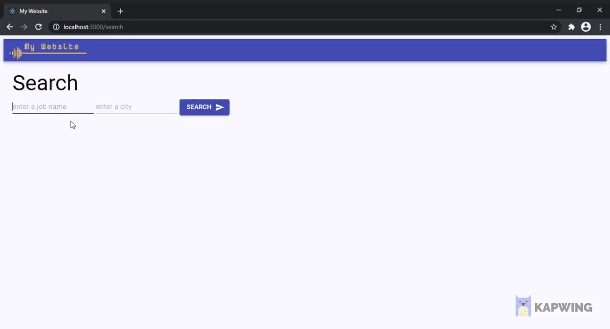

  <h3 align="center">Job Search Engine</h3>

  <p align="center">
    Using web scraping technic to get job search results from indeed and shows GlassDoor score, if exists, for each company</p>

<!-- ABOUT THE PROJECT -->

## About The Project



### Built With

-   [React](https://reactjs.org/)
-   [Redux](https://redux.js.org/)
-   [Puppeteer](https://pptr.dev/)

<!-- GETTING STARTED -->

## Getting Started

To get a local copy up and running follow these simple steps.

### Prerequisites

-   npm

    ```sh
    npm install npm@latest -g
    ```

-   Chromium - to be able to use Puppeteer

1. Remove Ubuntu chromium packages:

    ```sh
    sudo apt remove chromium-browser chromium-browser-l10n chromium-codecs-ffmpeg-extra
    ```

2. Add Debian buster repository. Create a file (you might need to use sudo) _/etc/apt/sources.list.d/debian.list_ with the following content:

    ```sh
    deb http://ftp.debian.org/debian buster main
    deb http://ftp.debian.org/debian buster-updates main
    deb http://ftp.debian.org/debian-security buster/updates main
    ```

3. Add the Debian signing keys:

    ```sh
    sudo apt-key adv --keyserver keyserver.ubuntu.com --recv-keys DCC9EFBF77E11517
    sudo apt-key adv --keyserver keyserver.ubuntu.com --recv-keys 648ACFD622F3D138
    sudo apt-key adv --keyserver keyserver.ubuntu.com --recv-keys AA8E81B4331F7F50
    sudo apt-key adv --keyserver keyserver.ubuntu.com --recv-keys 112695A0E562B32A
    ```

4. Configure apt pinning. Create a file (you might need to use sudo) _/etc/apt/preferences.d/chromium.pref_ with the following content:

    ```sh
    # Note: 2 blank lines are required between entries
    Package: *
    Pin: release a=eoan
    Pin-Priority: 500

    Package: *
    Pin: origin "ftp.debian.org"
    Pin-Priority: 300

    # Pattern includes 'chromium', 'chromium-browser' and similarly
    # named dependencies:
    Package: chromium*
    Pin: origin "ftp.debian.org"
    Pin-Priority: 700
    ```

5. Install Chromium again

    ```sh
    sudo apt update
    sudo apt install chromium
    ```

### Installation

1. Clone the repo
    ```sh
    git clone https://github.com/ronathan95/final-project.git
    ```
2. Install NPM packages
    ```sh
    npm install
    ```
